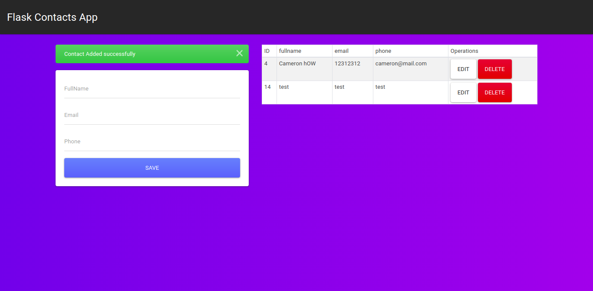

# Screenshot

# dependencias necesarias
- pip install flask
- pip install flask-mysqldb

# Crear una base de datos llamada "flaskcrud" con dos tablas: contactos y users
- contactos tiene campos: id, nombre, telefono e imail (todos not null con id autoincrementable y los demas son varchar con limite de 255)
- users tiene campos: id, username, password, email (todos not null con id autoincrementable y los demas son varchar con limite de 255)
